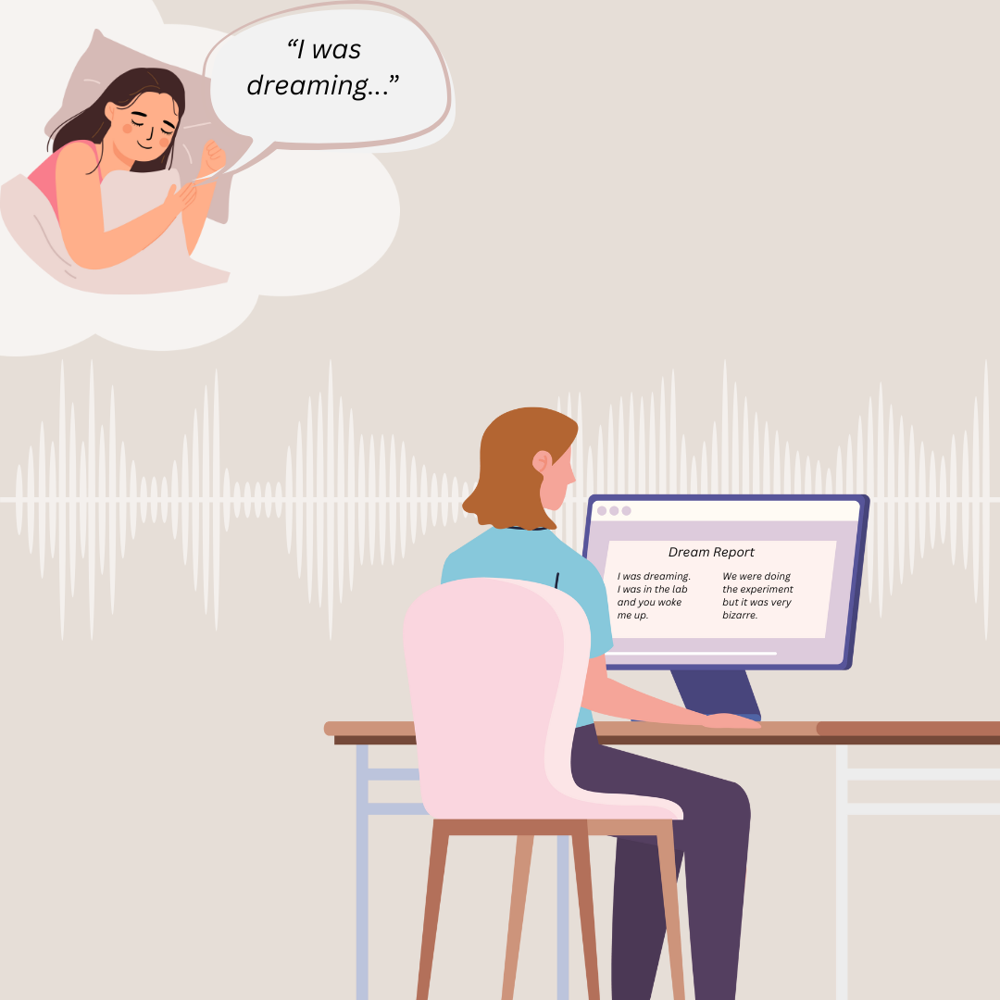

# Lucid Lab Bern: Speech-to-text Transcription 

  

The Lucid Lab Bern uses [Whisper from OpenAI](https://github.com/openai/whisper) to transcribe spoken dream recordings into written dream reports.

Different scripts are used to fulfill a diverse set of transcription-tasks. All scripts can be found here: [transcription_codes](<transcription codes>).

A tutorial on how to navigate the transcription process with this particular setup can be found here:[tutorial](<how to transcribe>).

This project was initiated by a master student in Sport Science Research at the University of Bern. Hence, this is a continous work in progress by someone who is not a programmer. It therefore cannot be guaranteed, that the scripts run flawelessly; however they represent a quite simple way to apply speech-to-text transcription to a variety of audio files, especially for people who are less advanced in programming.

For any questions/suggestions etc. please contact Johanna Heitmann (johanna.heitmann@students.unibe.ch).
