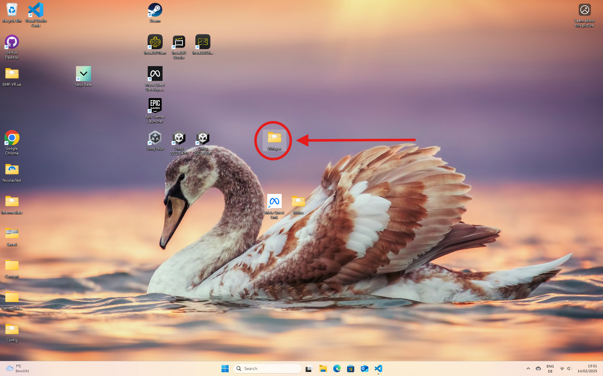
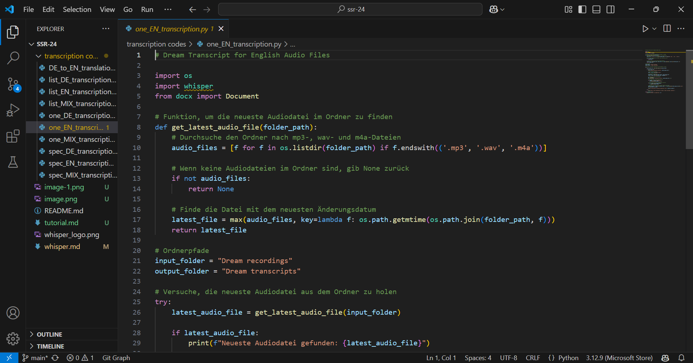
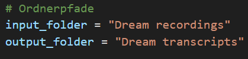
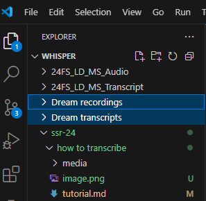
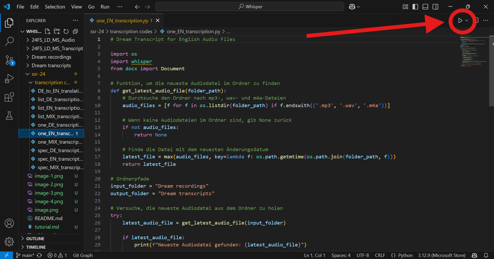

# How to: Speech-to-Text Transcription using Whisper

&rarr; The status quo is that the software runs on the VR-PC as this is a gaming PC and thus has very powerful hardware (GPU in this case) which makes the entire program run a lot smoother than on 'regular' PC's.

## General Information
This speech-to-text transcription relies on Whisper.  
Whisper is an automatic speech recognition system developed by OpenAI (yes, the same company that runs ChatGPT). The exact ways in which this works are irreelvant for the lucid lab purposes, important to know is that Whisper is well trained on over 680 000h of audio data and thereby somewhat robust in speech recognition.  
The end of this all is that the usage of Whisper allows us in the lab to run transcriptions locally on a PC. As dream recordings are highly personal data, we cannot use some transcription tool from the internet (since they usually send the audio data to a server to process and transcribe the recordings), even though these tools certainly are a lot more proffessional than this one righ here.  
But that also means, that hopefully the time that everyone of us has to listen to dream recordings is cut significantly short, since most of the work now will be done by Whisper.

## Setup
*This step is only relevant when starting a whole new project. When you're reading this while in the midst of an ongoing study, you may as well skip this and hop over to the [Transcription](#transcription) section. However, to decrease chances of data going missing or to places it definitely shouldn't, you can follow these steps along to double-check if everything is set up correctly.*

> For the transcription tool to work, a few things have to be set up properly, starting with the folder containing the audio files.

- Make sure that the folder with the audio files of the current nap study is saved within the folder "Whisper" on the VR-PC's desktop. 

  

    For example it could look like this (this is the example with which we proceed for this tutorial):

   &rarr; This is your `input-folder`. This is going to be relevant in a little bit. 
 

- Create an `output-folder`. This is the folder where the processed transcription will be saved in later on.
 

    This is what it could look like:

   &rarr; It makes sense to **match the name** of your `output-folder` to the name of your `input-folder`. This will make it a lot easier to determine what is what later on. 
   
 
 

Last but not least, check that the audio you want to transcribe is in your chosen `input-folder`.

## Transcription
As of now, there is no smooth way to let the transcription run by itself, which is the longterm plan, so the interaction with any programming environment should be limited at some point. 
As we are not there quite yet, the next steps will carefully walk you through everything you need to know. 

1. Open the 'Whisper' folder on the Desktop.

2. Within the 'Whisper' folder, there should be a subfolder called 'ssr-24'. 
   SSR stands for "Sport Science Research". The name should not concern you further, as it will be altered in a timely manner. 

3. Again, within the folder 'ssr-24' should be another folder called 'transcription codes'.
   This folder contains a variety of scripts, depending on what exactly you want to do.

   >&rarr; Any script starting with `list` is useful when you want to transcribe more than one audio file, namely an entire folder. When you use this script, all files that this script finds in your `input-folder` will be transcribed.  
   &rarr; Scripts starting with `one` will transcribe the *latest* audio file in your `input-folder`. This script should be useful in most cases as, if the lab-workflow goes according to plan, your audio file will be in fact the latest one added to the `input-folder`.   
   &rarr; If the script starts with `spec` that means you yourself can put the name of your *specific* audio file in the transcription script. This can be of use either your audio file is not, for whatever reasons (scientific work can be messy), the latest one in the `input-folder` or if you have an old or random file you want to have transcribed. If this is the case, you can consult the [specific transcription](#specific-spec-transcription) section.

   >&rarr; `DE`, `EN` and `MIX` are probably self-explanatory. If the spoken language in your audio file is German, you can chose the `DE`-version of the transcription script you want to run; the same goes if your dream recording is in English (= `EN`). 
   If you spoke both English and German during the recording, you probanly want to chose one of the `MIX`-versions, as the chances of your audio being transcribed correctly will be the best using this.

4. Decide on which transcription you want to do and then double click on the corresponding python (.py)- file.

5. The *Visual Studio Code* (VS Code) application should then open your chosen script automatically. This should look something like that: **CHANGE PICTURE**.

<small> (If not, consult the alternative route **INSERT ALTERNATIVE ROUTE**.) </small>

 

6. Now the creation of your `input- and output-folder` becomes relevant. Under  `#Ordnderpfade` you can insert the name of your corresponding folders, such as you see in the picture below.

&rarr;  The best you can do in order to get the filepath right is using *Drag-and-Drop*.
This you can do by selecting your folder from the sidebar (see picture below) and then dragging it over to your transcription-script. You should drop, using the `Ctrl`-Key it between the `""` (if there is already a folder name typed in, make sure it's either the one you want to be using as well or delete it before you insert your folder name).

 

 

> CAVE: Make sure that after you dropped the folder into your script, the name of your folder appears also in reddish tone you see in the picture. If not, the program won't be able to find your folder and you'll run into an error message.

7. When you've added the correct `input- and output-folder` names (paths) to your script, you should be ready to go. 

8. You can start the transcription-process by clicking the "play-button" in the upper right corner in the VS Code application. If a dropdown-menu appears, you simply select the option "*run python file*".

   

   

 

Your script should run now. This means that it searches for the audio file(s) in your `input-folder`, processes and transcribes it and finally saves it to your `output-folder`. 

 

**&rarr; *Good to know*:** All the scripts have "feedback-messages" built into them. This is just to make it easiert to comprehend what exactly is going on. 
These messages will appear in the terminal **INSERT PICTURE OF TERMINAL**. 
They will tell you:
- which audio file is being processed (to double-check whether you and the script got the right one) 
- or if the file to be transcribed couldn't be found in the first place 
- if the transcription was successful or not and 
- if the transcription indeed was successful, in which folder the word-document is saved.

<small><i>Depending on which script exactly you'll end up using, the "feedback-messages" will vary. Sometimes they might tell you something about a "GPU" being used. This you can ignore; it might only explain how fast the transcription process will be (as the process via the "GPU" should be quicker than "CPU").</i></small>

> Congrats! When you're done with all these steps, you've successfully used Whisper to transcribe your dream recording for you.

## Transcribed Data
Most of the work is done now, but we do not yet live in times where speech-to-text transcriptions made by computers is as accurate as human work.
Therefore the last steps should be:

1. Check the result of the whole transcription-process in the `output-folder`.
   &rarr; Is your file there? Does it have the correct name?
2. Go over the transcript and fix mistakes.
   &rarr; This 'Whisper'-modell should be quite accurate, but it is not immune to mistakes.
3. Remove names.
   &rarr; In the end, we don't want our participant's name to occur in the transcript for obvious privacy and data-protection reasons. This is why, whenever the participant's name occurs in the transcribed text, we substitute it with "VP" (short for the German word "Versuchsperson").
4. Add speakers.
   &rarr; As of now, speaker identification does not work. So you'll have to add yourself (the first letter of your name, e.g. "E" for Emma) and the participant (VP) to the script to be able to differentiate which sentences were spoken by either you or the participant.
5. Save the changes and add data wherever you were instructed to. 

## Troubleshooting
This whole transcription-tool was set up by someone who is rather new to programming. So if you're running into errors, feel free to blame me instead of yourself.
Below is a little section to fix mistakes that could be somewhat common. 
If you are still helpless or simply do not want to get mixed-up with this whole programming-thing (which I absolutely get), just feel free to text me (Johanna, my number should be in the sleeplab group-chat on Signal) or send me an E-Mail via johanna.heitmann@students.unibe.ch. I'll see that I can fix whatever went wrong quickly.

## Specific (`spec`) Transcription
The transcription of specific audio files is not much different, than any other transcription.
Built into the script is a message asking you to enter the name of your file, including the correct file extension. This message will also appear in the terminal. As soon as this message pops up, you can enter the name of your file. To avoid any mistakes, it could be best to just copy and paste it.
This script also contains feedback-messages, so it will let you know whether or not your file was found in your `input-folder`.